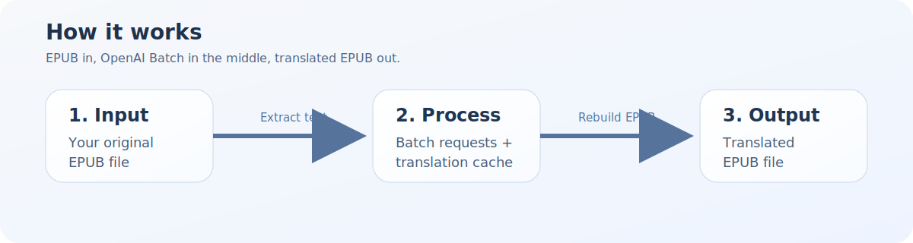

# translate-epub-ai

Translate EPUB books with OpenAI or Anthropic in a simple, copy-paste friendly way.

[Leer en español](README.es.md)



## The shortest version

If you only want the fast path:

1. Install the project.
2. Set your API key.
3. Run one command.

```bash
pip install -e .
python translate_epub_batch_v3.py "book.epub" --to es
```

Output:

```text
book_ES.epub
```

## What this tool does

You give it an EPUB file.

It will:

- open the EPUB safely
- find the human-readable text
- send translation jobs through a batch API
- keep the original EPUB structure
- generate a translated EPUB
- save progress so you can resume later

## What you need

- Python 3.10 or newer
- an OpenAI API key or an Anthropic API key

## Install

Open a terminal in the project folder and run:

```bash
pip install -e .
```

## Set your API key

OpenAI in PowerShell:

```powershell
$env:OPENAI_API_KEY="your_api_key_here"
```

Anthropic in PowerShell:

```powershell
$env:ANTHROPIC_API_KEY="your_api_key_here"
```

OpenAI in Command Prompt (`cmd`):

```cmd
set OPENAI_API_KEY=your_api_key_here
```

Anthropic in Command Prompt (`cmd`):

```cmd
set ANTHROPIC_API_KEY=your_api_key_here
```

macOS / Linux:

```bash
export OPENAI_API_KEY="your_api_key_here"
```

Anthropic on macOS / Linux:

```bash
export ANTHROPIC_API_KEY="your_api_key_here"
```

## Translate your first book

Basic example:

```bash
python translate_epub_batch_v3.py "book.epub" --to es
```

Example with a real model:

```bash
python translate_epub_batch_v3.py "book.epub" --to es --model gpt-4.1-mini
```

Anthropic example:

```bash
python translate_epub_batch_v3.py "book.epub" --provider anthropic --model claude-sonnet-4-20250514 --to es
```

## Useful commands

Prepare everything but do not send the batch yet:

```bash
python translate_epub_batch_v3.py "book.epub" --to es --prepare-only
```

Resume a batch you already created:

```bash
python translate_epub_batch_v3.py "book.epub" --resume-batch-id batch_123
```

Important:

- if you do not set `--provider`, it still uses `openai`
- this keeps backward compatibility with the old usage
- cache and resume still work so translated segments are not requested again

Use a custom prompt file:

```bash
python translate_epub_batch_v3.py "book.epub" --to es --prompt-file my_prompt.txt
```

## Want better translation style?

The default prompt lives here:

```text
src/translate_epub_ai/prompts/default_prompt.txt
```

You can:

- edit that file directly
- pass your own file with `--prompt-file`

This means you can improve tone, style, and fluency without changing Python code.

## Run tests

```bash
python -m unittest discover -s tests -v
```

## Project layout

```text
src/translate_epub_ai/cli.py
src/translate_epub_ai/epub.py
src/translate_epub_ai/batch_providers.py
src/translate_epub_ai/prompting.py
tests/
```

## What each file does

- `cli.py`: command-line entry point
- `epub.py`: extract and rebuild EPUB files
- `batch_providers.py`: provider-specific batch logic for OpenAI and Anthropic
- `prompting.py`: generate the translation prompt
- `tests/`: keep refactors safer

## Included tests

This repo currently checks:

- prompt generation
- batch grouping logic
- prompt quality using a difficult passage from *The Beginning of Infinity*

## Troubleshooting

If you see `OPENAI_API_KEY is not set`, set the environment variable first.

If you are using Anthropic, set `ANTHROPIC_API_KEY` instead and add:

```bash
--provider anthropic
```

If you want to inspect the generated batch files before sending them, use:

```bash
python translate_epub_batch_v3.py "book.epub" --to es --prepare-only
```

If you want to change the translation style, start by editing:

```text
src/translate_epub_ai/prompts/default_prompt.txt
```
